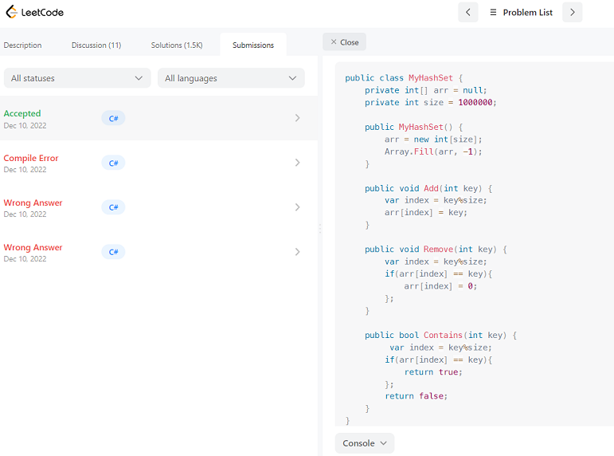
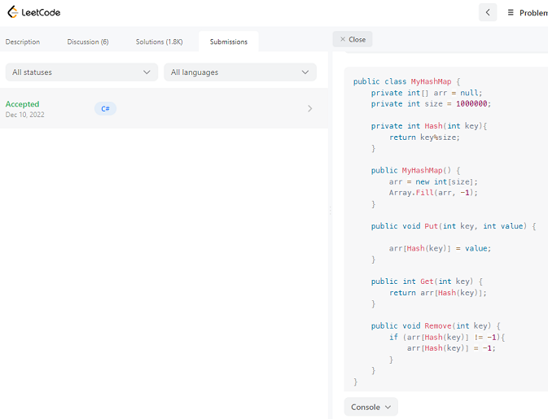

<div align="center">
  <h1> Hash Tables</h1>
<sub>Author:
<a href="https://www.linkedin.com/in/chidi-jude" target="_blank">Chidi Jude</a><br>
</sub>

</div>

[<< Week 2](../Week%202%20Strings_Array_List/Strings%20Array%20and%20List.md) | [Week 4 >>](../readme.md)


- [📘 Week 3 Hash Tables](#-week-3)
  - [Hash Table](#hash-table)
  - [Hash Sets](#hash-sets)
    - [Hash Set Class Implementation](#implementation-of-hash-set-class)
    - [Hash Set Submission](#hash-set-class-leetcode-submission)
  - [Hash Maps](#hash-maps)
    - [Hash Map Class Implementation](#implementation-of-hash-map-class)
    - [Hash Map Submission](#hash-map-class-leetcode-submission)

    
# 📘 Week 3
## Hash Table
Hash Table is a data structure which organizes data using hash functions in order to support quick insertion and search. (leetcode)

## Hash Sets
Hash sets are sets that use hashes to store elements. A hashing algorithm is an algorithm that takes an element and converts it to a chunk of fixed size called a hash.

### Implementation of Hash Set class

- Creating an hash set class

```csharp
public class MyHashSet {
    private int[] arr = null;
    private int size = 1000000;

    public MyHashSet() {
        arr = new int[size];
        Array.Fill(arr, -1);
    }
    
    public void Add(int key) {
        var index = key%size;
        arr[index] = key;
    }
    
    public void Remove(int key) {
        var index = key%size;
        if(arr[index] == key){
            arr[index] = 0;
        };
    }
    
    public bool Contains(int key) {
         var index = key%size;
        if(arr[index] == key){
            return true;
        };
        return false;
    }
}
```
### Hash Set class Leetcode Submission


## Hash Maps

A hash map, is a data structure that maps keys to values.

### Implementation of Hash Map class

- Creating an hash Map class

```csharp
public class MyHashMap {
    private int[] arr = null;
    private int size = 1000000;
   
    private int Hash(int key){
        return key%size;
    }

    public MyHashMap() {
        arr = new int[size];
        Array.Fill(arr, -1);
    }
    
    public void Put(int key, int value) {
        
        arr[Hash(key)] = value;
    }
    
    public int Get(int key) {
        return arr[Hash(key)];
    }
    
    public void Remove(int key) {
        if (arr[Hash(key)] != -1){
            arr[Hash(key)] = -1;
        }
    }
}
```
### Hash Map class Leetcode Submission

